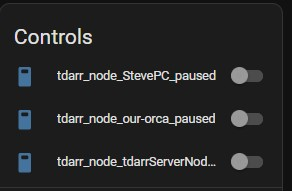
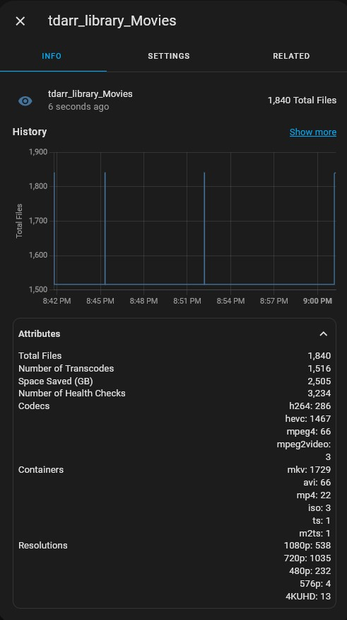

# Tdarr Home Assistant Integration

This is a fork of [itchannel/tdarr_ha](https://github.com/itchannel/tdarr_ha) aiming to make the intergration more user friendly and make it easier to maintain and extend.

Thanks to itchannel for their initial work on this integration. "Buy them a coffee" link is available on their repository linked above.

## Install

Use HACS and add as a custom repo. Once the integration is installed go to your integrations and follow the configuration options below:

- Tdarr Server IP or hostname
- Tdarr Port (Prefilled to Tdarr default port 8265)

## Currently Supported

- Server status
- Node information
- Node FPS
- Library information and Statistics
- Switches to pause/unpause a node

## Screenshots

## Additional Information

The integration will automatically add new nodes as they come online. Old nodes that are no longer used will need to be manually deleted from HA if no longer used.

All sensors display any available additional info in the sensor attributes section. This information can be used by you to create more verbose sensors using Home Assistant templates. 

## Contributing

### Development

Files are included in the repository for development in VSCode:

1. Clone the repository
2. Open in VSCode
3. Ensure you have the devcontainers extension installed, then press F1 > Reopen in devcontainer
4. To run Home Assistant with the component already installed:
    1. F1 > Run task
    2. Run Home Assistant

**NOTE:** Breakpoints are not working with the current configuration.
