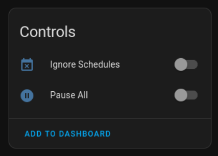
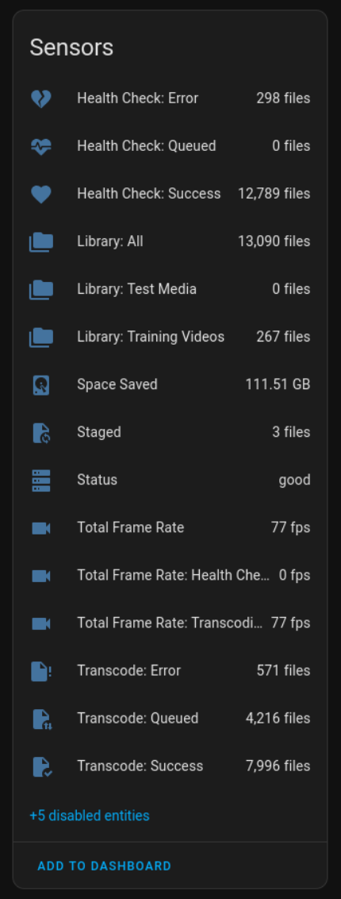
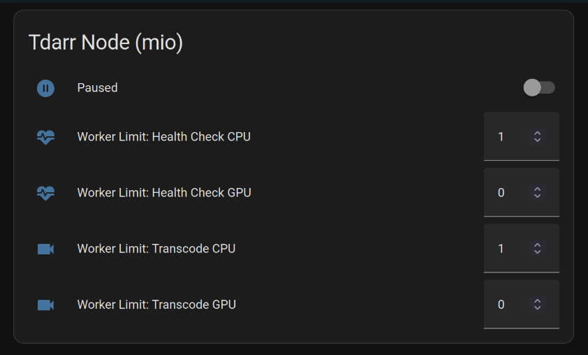
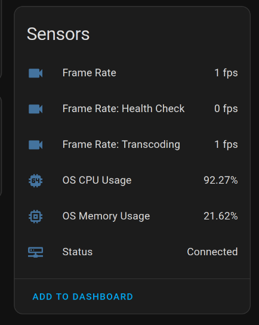

# Tdarr Home Assistant Integration

This is a fork of [itchannel/tdarr_ha](https://github.com/itchannel/tdarr_ha) aiming to make the intergration more user friendly and make it easier to maintain and extend.

Thanks to itchannel for their initial work on this integration. "Buy them a coffee" link is available on their repository linked above.

## Install

Via HACS, add this repository as a custom repo and download the integration.

Once the integration is installed, add via the normal integrations page.

## Features

- Server Sensors:
    - Server status
    - Space saved
    - File counts for health check and transcode queue, success/not required and failures
    - Staged file count
    - Library file counts
    - Total processing frame rate for health checks, transcodes, and combined
- Server Controls:
    - Pause all nodes
    - Disable schedules
- Node Sensors:
    - Status sensor
    - OS CPU Usage
    - OS Memory Usage (in percent but GB available in attributes)
    - Processing frame rate for health checks, transcodes, and combined (total for node, not each worker)
- Node Controls:
    - Pause node
    - Worker limits
- Services:
    - Scan Library
    - Cancel Worker Item
    - Get Worker Information

Some additional details are available via attributes.

## Screenshots

### Server

# Nodes

## Blueprints

Blueprint scripts and automations are stored in the [Blueprints folder](./blueprints/). These can be imported to Home Assistant via the URL. See the [Home Assistant Documentation](https://www.home-assistant.io/docs/automation/using_blueprints/) for details.

## Additional Information

The integration will automatically add new nodes as they come online. Old nodes that are no longer used will need to be manually deleted from HA if no longer used.

All sensors display any available additional info in the sensor attributes section. This information can be used by you to create more verbose sensors using Home Assistant templates. 

## Contributing

### Development

Files are included in the repository for development in VSCode:

1. Clone the repository
2. Open in VSCode
3. Ensure you have the devcontainers extension installed, then press F1 > Reopen in devcontainer
4. To run Home Assistant with the component already installed:
    1. F1 > Run task
    2. Run Home Assistant
